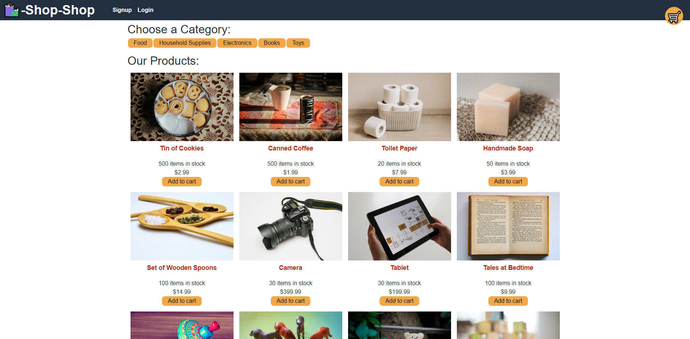

# Shop-Shop Redux: A Redux Code Refactor Project

In order to learn Redux, a state container for JS apps, this e-commerce site was refactored from React's Context API to Redux.

## Description

The Shop-Shop site allows a user to "checkout" various items after logging in and "paying" for them via Stripe Checkout.  
**(NOTE: None of these products are actually for sale, this site was created in order to learn Redux and State programming. DO NOT ENTER IN ACTUAL CREDIT CARD INFO AS PRODUCTS "ORDERED" ARE NOT REAL)**

## Installation

Check out the [Shop-Shop](https://blooming-thicket-74730.herokuapp.com/) Site.

## Usage

Once at the Shop-Shop website, feel free to browse the various products by category and viewing each individual product (enjoy the descriptions, VERY accurate!). If you would like to "checkout" any items, you will need to login/signup. After filling in the proper info for the login/signup, proceed to add products to your cart and then click "checkout". You will be redirected to a Stripe checkout page where you can "purchase" the items from your cart.  
**(Again, this site was created as a learning opportunity, not for actual e-commerce. DO NOT PLAN TO PURCHASE THESE PRODUCTS!)**  
Thanks for "checking out" the site!

## Technologies Used

- Node.js
- Express.js
- Heroku
- GraphQL
- Apollo Server
- Redux
- Stripe

## Credits

Code conversion to Redux done by myself, [mfcodingbc](https://github.com/mfcodingbc). Any questions on the site or the code refactoring can be directed to me.

## License

[MIT](https://choosealicense.com/licenses/mit/)
